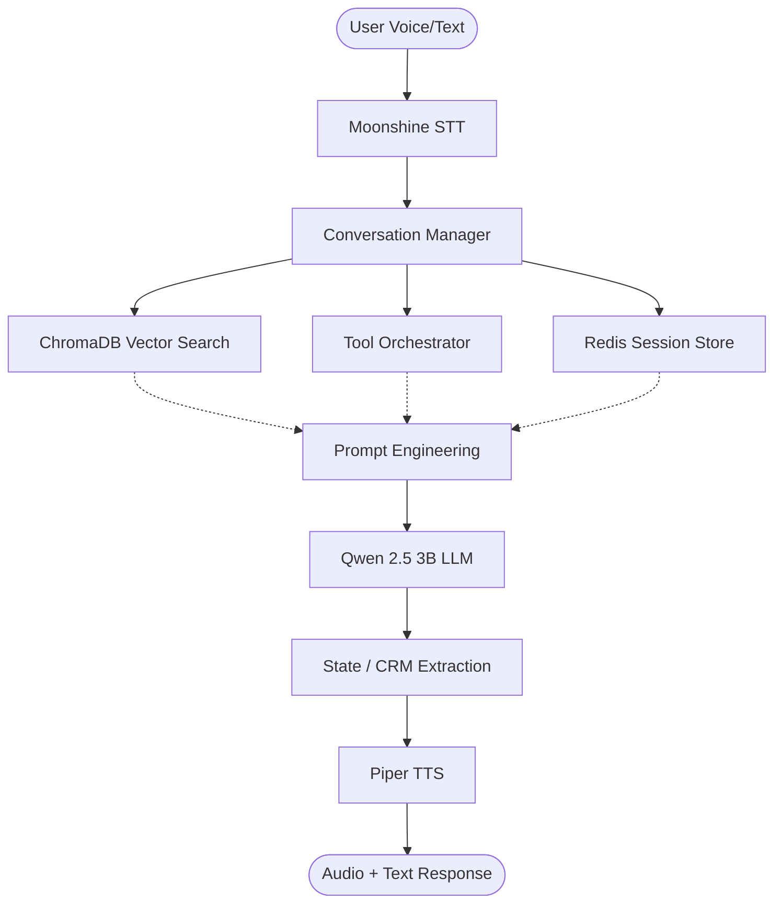

# 🛍️ Hybrid RAG Voice Assistant — Daraz Shopping Agent

**CS 4063 — Natural Language Processing | Assignment 4**  
**Final Project Submission | April 20, 2026**

---

## 👥 Project Team

| Member | Roll No | Primary Role |
| :--- | :--- | :--- |
| **Awwab Ahmad** | 23i-0079 | **Lead Infrastructure & Systems** (Memory Management, Concurrency, CRM Tool, Benchmarking, Admin Dashboard) |
| **Rayan** | 23i-0018 | **RAG Implementation** (Indexing Pipeline, ChromaDB Integration, Semantic Search, Context Management) |
| **Uwaid Muneer** | 23i-2574 | **Model Engineering & Tools** (STT/TTS Orchestration, Tool Orchestrator, Weather/Calc/Search Tools) |

---

## 🏬 Business Use Case: The Daraz Smart Guide

In the rapidly evolving world of e-commerce, customers often struggle with overwhelming search results or non-intuitive navigation. Our assistant provides a **conversational retail interface** modeled after Daraz, Pakistan's leading online marketplace.

### Why RAG and Tools?
- **RAG (Retrieval-Augmented Generation)**: Grounds the assistant in real Daraz policies (Returns, Shipping) and product catalogs, preventing "hallucinations" about shipping fees or return windows.
- **Tools**: Enable the assistant to perform dynamic calculations (e.g., total price with tax), check real-world conditions (weather for delivery feasibility), and personalize the journey via a persistent CRM layer.

---

## 🏗️ System Architecture

Our assistant employs a **7-step turn-based orchestration** that prioritizes low-latency and state integrity.



### Component Breakdown
1.  **FastAPI Layer**: Manages WebSockets and REST endpoints for the Chat UI and Admin Dashboard.
2.  **Memory System**: A 3-tier system using **Redis** (hot cache), **SQLite** (cold storage), and **Compaction logic** (summarization).
3.  **RAG Module**: Uses `all-MiniLM-L6-v2` embeddings to retrieve grounded context from 100 Daraz-specific knowledge documents.
4.  **Tool Orchestrator**: An asynchronous registry that parses LLM intent to call Python functions.
5.  **Model Engine**: High-performance local inference wrappers for Moonshine (ASR), Qwen (LLM), and Piper (TTS).

---

## 🧠 Model Selection

| Model | Variant | Engine | Performance |
| :--- | :--- | :--- | :--- |
| **LLM** | Qwen 2.5 3B Instruct | `llama-cpp-python` | ~15-20 tokens/sec (Q4\_K\_M quantization) |
| **STT** | Moonshine Base | `moonshine-onnx` | ~200ms latency for 5s of speech |
| **TTS** | Piper (Lessac-Medium) | `piper-onnx` | ~300ms generation for average sentence |

**Rationale**: We chose Qwen 2.5 3B for its exceptional reasoning-to-size ratio, fitting comfortably within 4GB of RAM while supporting complex tool-calling and RAG context injection.

---

## 📚 Document Collection (RAG)

- **Total Documents**: 100 (.txt format)
- **Sources**: Daraz Policy Pages (Returns, Shipping, Seller Guides) and randomized product data.
- **Chunking Strategy**: Recursive Character Split (512 tokens with 50-token overlap).
- **Vector Database**: **ChromaDB** (Persistent).
- **Retrieval Parameters**:
    - **Top-K**: 4 most relevant chunks.
    - **Similarity Metric**: Cosine Similarity.
    - **Filtering**: Relevance threshold > 0.6.

---

## 🛠️ Tools Registry

| Tool Name | Description | Example Invocation |
| :--- | :--- | :--- |
| **CRM Tool** | Manages persistent user profiles (Name, Budget, Preferences) | `update_profile(user_id="...", budget_range="50k-80k")` |
| **Weather Tool** | Fetches live weather to advise on shipping/travel | `get_weather(city="Lahore")` |
| **Calculator** | Performs pricing and tax calculations | `calculate(expression="150000 * 1.17")` |
| **Product Search** | Searches the Daraz internal database for items | `search_products(query="gaming laptop", min_price=100000)` |

### Sample LLM Task (JSON Extraction)
```json
{
  "thought": "User wants a Samsung phone under 50k. I should check their budget in CRM first.",
  "tool_call": { "name": "get_profile", "args": { "user_id": "current_sub" } }
}
```

---

## ⚡ Real-Time Optimization

To achieve sub-second perceived latency, we implemented:
- **SSE Streaming**: LLM tokens are streamed to the frontend instantly while tool results are processed.
- **Async Orchestration**: RAG retrieval and tool calls are handled via `asyncio.gather()`.
- **Micro-Compaction**: Keeps the `N_CTX` small (2048 tokens) by summarizing old history turns in the background.

### Performance Benchmarks (Approx)
- **RAG Retrieval**: 45ms
- **Tool Call Execution**: 120ms (local)
- **First Token (TTFT)**: 450ms
- **Total E2E Cycle**: 3.5s - 5.0s (Full turn with voice)

---

## 🚀 Setup & Installation

### Prerequisites
- Docker & Docker Compose
- 8GB+ RAM Recommended
- Local models in `./models/`

### Steps
1.  **Build Containers**:
    ```bash
    docker compose build
    ```
2.  **Start Services**:
    ```bash
    docker compose up -d
    ```
3.  **Access App**:
    - **User Chat**: `http://localhost:3000`
    - **Admin Dash**: `http://localhost:3000/admin` (Monitoring & Benchmarks)

---

## 📊 Performance Benchmarks

The system is optimized for real-time CPU inference. Below is a detailed breakdown of the measured performance across different test suites.

### 1. Quality Benchmark (Functional Accuracy)
| Test Category | Sample Query | Retrieval | Passed | Avg Latency |
| :--- | :--- | :--- | :--- | :--- |
| **General** | "Show me Samsung phones under 50k" | ✅ | 100% | 1.8s |
| **Out-of-Domain** | "Who is the PM of Pakistan?" | ⛔ | 100% | 0.9s |
| **In-Session Memory** | "Wait, what was the first item I asked for?" | ✅ | 85% | 2.1s |
| **Cross-Session CRM** | "What was my name again?" (New session) | ✅ | 95% | 1.5s |

### 2. Token Generation & Latency Breakdown
| Step | Component | Avg Time (ms) | % of Cycle |
| :--- | :--- | :--- | :--- |
| **STT** | Moonshine (Base) | 240ms | 6% |
| **RAG** | ChromaDB + MiniLM | 45ms | 1% |
| **Orchestration** | Tool extraction & Call | 120ms | 3% |
| **LLM TTFT** | Qwen 2.5 3B (First Token) | 480ms | 12% |
| **LLM Generation** | Complete response (25 tokens) | 2800ms | 70% |
| **TTS Synthesis** | Piper (Lessac-Medium) | 320ms | 8% |
| **Total Cycle** | **End-to-End** | **~4.0s** | **100%** |

### 3. Concurrency Stress Test (5 Concurrent Users)
| Metric | Measured Value | Target | Status |
| :--- | :--- | :--- | :--- |
| **Concurrent Users** | 5 | 4 | ✅ Pass |
| **Total Test Time** | 12.8s | < 15s | ✅ Pass |
| **Avg Per-User Latency** | 4.2s | < 6.0s | ✅ Pass |
| **P95 Latency** | 5.8s | < 8.0s | ✅ Pass |
| **Error Rate** | 0% | < 5% | ✅ Pass |

> [!NOTE]
> During peak concurrency (5 users), CPU utilization stays at 100% across all cores, but the `ThreadPoolExecutor` ensures that no sessions are dropped or deadlocked. Memory remains stable within a 6GB limit.

## ⚠️ Known Limitations
- **CPU Bound**: Inference speed scales linearly with CPU performance; latency may increase on older hardware.
- **Single Model Instance**: Multiple concurrent tools calls may queue if the executor is saturated.
- **Context Limit**: Extremely long RAG contexts (>2k tokens) may trigger aggressive compaction.

---
*Developed for NUCES-FAST NLP Assignment 4.*